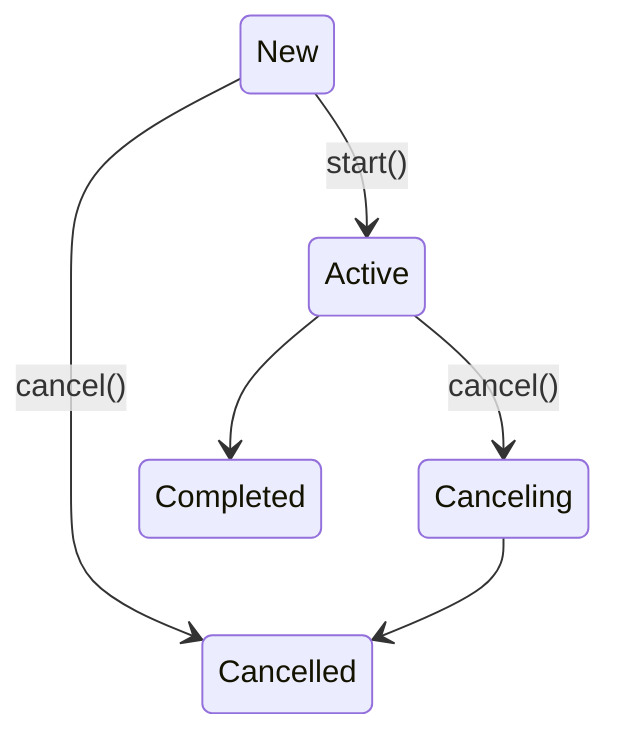

# 3장. 라이프 사이클과 에러 핸들링
## 비동기 작업
- Job
  - 결과가 없는 비동기 함수
  - fire and forget
  - 생성 방법 (job)
    - 코루틴 빌더: launch()
    - 팩토리 함수: Job()
- Deferred
  - 결과를 반환하는 비동기 함수
  - Job을 확장 (Future, Promise)
  - 생성 방법 (task)
    - async()
  - 결과값 확인
    - await()
    - Job과 달리 예외를 전파하지 않고 결과값을 통해 확인하도록 함
## 라이프 사이클 (단방향, 재시작 없음)

- New
  - launch(start = CoroutineStart.LAZY)
- Start
  -  start(): 완료까지 기다리지 않음
  -  join(): 완료까지 기다림
- Canceling
  -  cancel()
  -  cancelAndJoin()
- Cancelled
  - 취소 or 처리되지 않은 예외로 실행 종료
  - 예외 
    - getCancellationException()
    - CoroutineExceptionHandler: launch() parameter
    - invokeOnCompletion()

## 상태 확인
|State|isActive|isCompleted|isCancelled|
|------|---|---|---|
|New|false|false|false|
|Active|true|false|false|
|Canceling|false|false|true|
|Cancelled|false|true|true|
|Completed|false|true|false|
