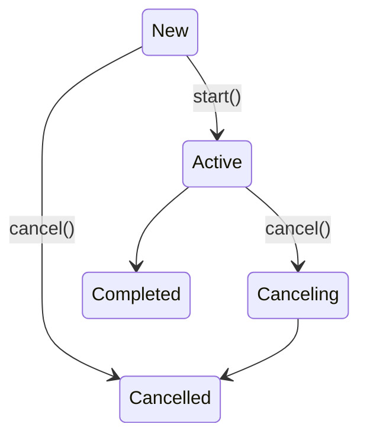

# 3장. 라이프 사이클과 에러 핸들링
## 비동기 작업
- Job
  - 결과가 없는 비동기 함수
  - fire and forget
  - 생성 방법 (job)
    - 코루틴 빌더: launch()
    - 팩토리 함수: Job()
- Deferred
  - 결과를 반환하는 비동기 함수
  - Job을 확장 (Future, Promise)
  - 생성 방법 (task)
    - 코루틴 빌더: async()
  - 결과값 확인
    - await(): 호출하기 전까가지는 job이 시작되지도 
    - Job과 달리 예외를 전파하지 않고 결과값을 통해 확인하도록 함
## 라이프 사이클 (단방향, 재시작 없음)

- New
  - launch(start = CoroutineStart.LAZY)
- Start
  -  start(): 완료까지 기다리지 않음
  -  join(): 완료까지 기다림
- Canceling
  -  cancel()
  -  cancelAndJoin()
- Cancelled
  - 취소 or 처리되지 않은 예외로 실행 종료
  - 예외 
    - getCancellationException()
    - CoroutineExceptionHandler: launch() parameter
    - invokeOnCompletion()

## 상태 확인
|State|isActive|isCompleted|isCancelled|
|------|---|---|---|
|New|false|false|false|
|Active|true|false|false|
|Canceling|false|false|true|
|Cancelled|false|true|true|
|Completed|false|true|false|


# 4장. 일시 중단 함수와 코루틴 컨텍스트
## 일시 중단 함수
- 코루틴 빌더(launch(), async(), runBlocking())를 호출할 때 전달하는 코드는 일시 중단 람다(suspending lambda)
- 함수 시그니처에 suspend 제어자만 추가
- 다른 일시 중단 함수 직접 호출 가능 (delay())
- 코루틴 외부에서 호출 불가 (컴파일 에러)

### 구현 비교
#### 비동기 함수
```
interface ProfileServiceRepository {
  fun asyncFetchByName(name: String): Deferred<Profile>
}

class ProfileServiceClient : ProfileServiceRepository {
  override fun aysyncFetchByName(name: String) = GlobalScope.async {
    Profile(1, name, 28)
  }
}

fun main(args: Array<String> = runBlocking {
  val client: ProfileServiceRepository = ProfileServiceClient()
  val profile = client.asyncFetchByName("Tom").await()
}
```
#### 일시 중단 함수
```
interface ProfileServiceRepository {
  suspend fun fetchByName(name: String): Profile
}

class ProfileServiceClient : ProfileServiceRepository {
  override suspend fun fetchByName(name: String): Profile {
    return Profile(1, name, 28)
  }
}

fun main(args: Array<String> = runBlocking {
  val client: ProfileServiceRepository = ProfileServiceClient()
  val profile = client.fetchByName("Tom")
}
```

## 코루틴 컨텍스트
- 코루틴이 어떻게 실행되고 동작해야 하는지를 정의할 수 있게 해주는 요소들의 그룹

### 디스패처(Dispatcher)
- 코루틴이 실행될 스레드를 결정
- CommonPool: CPU 바운드 작업을 위해서 프레임워크에 의해 자동으로 생성되는 스레드 풀
- 기본 디스패처: CommonPool > Dispatchers.Default
- Unconfined(무한정의)
  - Dispatchers.Unconfined
  - 일시 중단 이후 다시 시작될 때 이전 일시중단함수가 실행된 스레드에서 시작됨
- 단일 스레드 컨텍스트: 항상 특정 스레드 안에서 실행된다는 것을 보장
  - newSingleThreadContext()
- 스레드 풀
  - newFixedThreadPoolContext()

### 예외 처리
- CoroutineExceptionHandler
- withContext(NonCancellable): 코루틴이 취소되는 동안 일시 중지가 필요한 경우 (finally)

### 컨텍스트 결합
#### 조합
```
val context = dispatcher + handler
launch(context) { ... }
```
#### 분리
```
val context = dispatcher + handler
val tmpCtx = context.minusKey(dispatcher.key)
launch(tmpCtx) { ... }
```

### withContext
- 임시 컨텍스트 스위치
- 전달한 람다의 마지막 구문에 해당하는 값을 반환함

```
fun main(args: Array<String>) = runBlocking {
  val dispatcher = newSingleThreadContext("myThread")
  val name = GlobalScope.async(dispatcher) {
    ...
    "Susan Calvin"
  }.await()
  println("User: $name")
}
```

```
fun main(args: Array<String>) = runBlocking {
  val dispatcher = newSingleThreadContext("myThread")
  val name = withContext(dispatcher) {
    ...
    "Susan Calvin"
  }
  println("User: $name")
}
```
