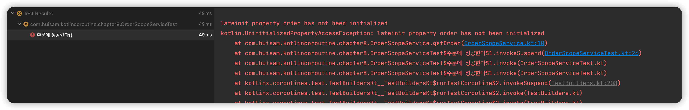
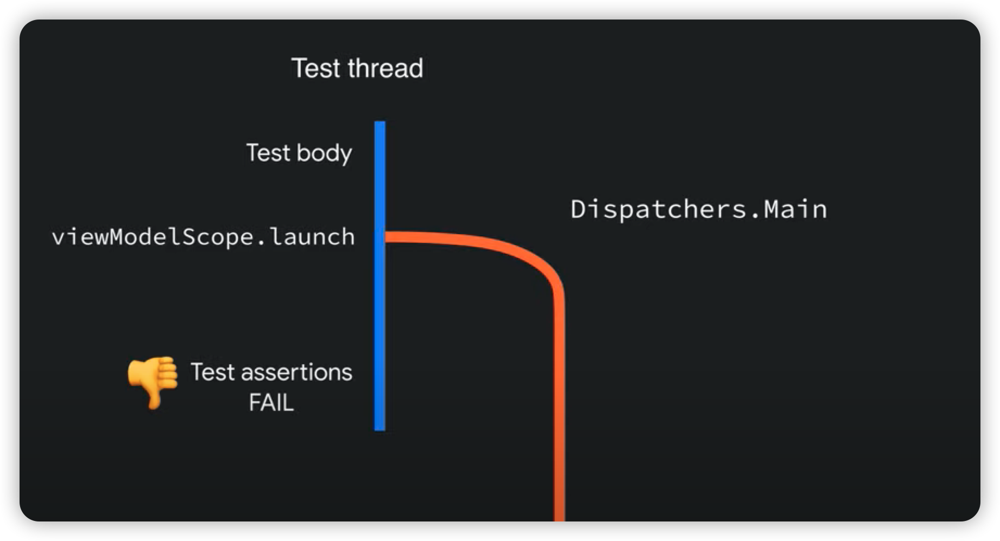
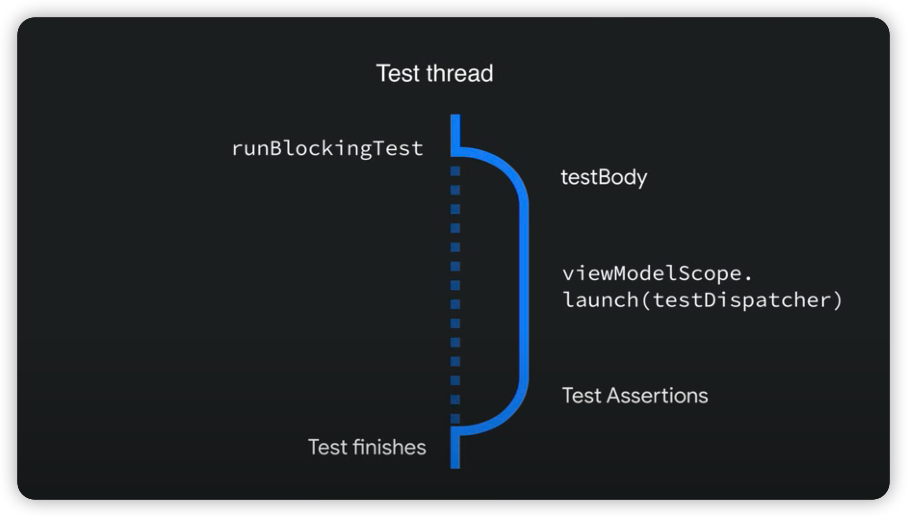

## 8장 동시성 코드 테스트와 디버깅

우리는 테스트가 무엇을 위하고, 어떤 속성을 가진 것인지를 먼저 알아야 합니다.  

단위 테스트는

```text
1. 빨라야 합니다
2. 결과를 즉시 알 수 있어야 합니다
3. 환경에 독립적이어야 합니다
```

하나라도 항목을 갖춰있지 않다면 이는 유지보수하기 어려운 단위 테스트이며,  
단위 테스트를 작성하는 의미가 많이 떨어집니다.  

따라서 **코루틴을 테스트하기 위해서는 병목 포인트(혹은 지연 포인트)에 대해 테스트**가 이루어져야 합니다.  

그런데 병목 현상을 다 기다리면서 테스트하게 되면 어떻게 될까요? 🤔  
> 코루틴을 만들고 await 하면서 테스트 해야 될까요??

아래 [영상](https://www.youtube.com/watch?v=KMb0Fs8rCRs)을 참고하여 어떻게 해결할지 알아봅시다.  

### Coroutine Test

바로 실전부터 들어가봅시다.  

아래와 같은 시나리오를 고려하고 싶습니다.  

* Purhcaser 는 Order 를 하고 싶다.
* 그래서 상품정보와 유저정보를 바탕으로 주문을 생성해야 된다.
* 상품정보를 가져오는데는 500ms 의 latency 가 걸리며, 유저 정보를 가져오는데는 1000ms 의 latency 가 걸린다 
* 문제는 주문과정에서 결제도 해야되기 때문에 1000ms 의 latency 가 또 걸린다.

이를 코루틴으로 해결한 코드를 나타내보자

```kotlin
data class Member(
    val id: String,
    val name: String,
)

class MemberService {
    suspend fun findMemberById(memberId: String): Member {
        delay(1000)
        return Member(memberId, "purchaser1")
    }
}
```

위에는 아주 간단하게 멤버정보를 가져오는 코드입니다.

```kotlin
data class Product(
    val id: String,
    val price: BigDecimal
)

class ProductService {
    suspend fun findProductById(productId: String): Product {
        delay(500)
        return Product(productId, 1000.toBigDecimal())
    }
}
```

마찬가지로 상품정보도 쉽게 가져옵니다

```kotlin
data class Order(
    val purchaser: Member,
    val product: Product
)

class OrderService(
    private val productService: ProductService = ProductService(),
    private val memberService: MemberService = MemberService(),
) {

    suspend fun order(productId: String, memberId: String): Order {
        val product = productService.findProductById(productId)
        val member = memberService.findMemberById(memberId)

        delay(1000)

        return Order(purchaser = member, product = product)
    }
}
```

2개의 서비스를 기반으로 주문을 생성하는 주문 서비스입니다.  

어떻게 `OrderService` 의 `order` 메소드를 테스트할 수 있을까요?  
우리는 이러한 delay(1000) 이나 되는 시간을 테스트하면서 기다려야 할까요?  

테스트부터 작성해보겠습니다.  

```kotlin
    @Test
    @Timeout(1000, unit = TimeUnit.MILLISECONDS)
    fun `지연이 없이 주문되는 경우`() = runTest {
        // given
        val productId = "product1"
        val memberId = "member1"
        coEvery { productService.findProductById(any()) } returns Product(productId, 10.toBigDecimal())
        coEvery { memberService.findMemberById(any()) } returns Member(memberId, "purchaser_1")

        // when
        val order = orderService.order(productId, memberId)

        // then
        assertThat(order).usingRecursiveComparison()
            .isEqualTo(
                Order(
                    product = Product(productId, 10.toBigDecimal()),
                    purchaser = Member(memberId, "purchaser_1")
                )
            )
        coVerify {
            productService.findProductById(productId)
            memberService.findMemberById(memberId)
        }
        confirmVerified(productService, memberService)
    }
```

주문을 결제할 때 1000ms 의 지연이 걸리지만, 놀랍게도 위 테스트는 성공합니다.   

`runTest` 라는 TestScope 을 지정하게 되면, 내부적으로 `TestCoroutineScheduler` 에 의해서 delay 시간을 앞당기기 때문입니다.  

```kotlin
    private fun tryRunNextTask(): Boolean {
        val event = synchronized(lock) {
            val event = events.removeFirstOrNull() ?: return false
            if (currentTime > event.time)
                currentTimeAheadOfEvents()
            currentTime = event.time
            event
        }
        event.dispatcher.processEvent(event.time, event.marker)
        return true
    }
```

바로 위와 같은 흐름을 통해 지연되는 이벤트를 가져오고 `TestDispatcher` 가 강제적으로 이벤트를 실행해버립니다.  

그래서 우리는 테스트할 때 지연시간에 대한 걱정은 사라진 것이죠 😄  

더군다나 `mockk` 를 기반으로 상품 쪽에 지연에 대한 가정한 테스트도 가능합니다.  

```kotlin
    @Test
    @Timeout(1000, unit = TimeUnit.MILLISECONDS)
    fun `상품쪽에 지연되어 주문되는 경우`() = runTest {
        // given
        val productId = "product1"
        val memberId = "member1"
        coEvery { productService.findProductById(any()) } coAnswers {
            delay(1_000)
            Product(productId, 10.toBigDecimal())
        }
        coEvery { memberService.findMemberById(any()) } returns Member(memberId, "purchaser_1")

        // when
        val order = orderService.order(productId, memberId)

        // then
        assertThat(order).usingRecursiveComparison()
            .isEqualTo(
                Order(
                    product = Product(productId, 10.toBigDecimal()),
                    purchaser = Member(memberId, "purchaser_1")
                )
            )
        coVerify {
            productService.findProductById(productId)
            memberService.findMemberById(memberId)
        }
        confirmVerified(productService, memberService)
    }
```

### Test Scope 

저희는 suspend 함수와 실제 delay 된다는 가정한 단위 테스트를 작성해보았습니다.  

그런데, 테스트하고자 하는 기능에 새로운 Scope 를 생성하게 된다면 어떻게 될까요?  

```kotlin
class OrderScopeService(
    private val orderService: OrderService = OrderService()
) {
    lateinit var order: Order

    fun order(productId: String, memberId: String) {
        CoroutineScope(Dispatchers.Main).launch {
            order = orderService.order(productId, memberId)
        }
    }
}

```

위와 같은 새로운 Scope 를 생성하는 코루틴을 만드는 함수를 만들고, 테스트 해봅시다  

```kotlin
    @Test
    fun `주문에 성공한다`() = runTest {
        // given
        val productId = "product1"
        val memberId = "member1"

        // when
        orderScopeService.order(productId, memberId)

        // then
        assertThat(orderScopeService.order).usingRecursiveComparison()
            .isEqualTo(
                Order(
                    product = Product(productId, 1000.toBigDecimal()),
                    purchaser = Member(memberId, "purchaser1")
                )
            )
    }
```

놀랍게도 실패합니다.  

<div>
    
</div>

이러한 현상은 테스트 scope 와 새로운 scope 의 쓰레드 처리가 다르기 때문에 나타나는 현상인데요.  

<div>
    
</div>

그렇다고, launch 에 해당하는 Job 을 await 하면서 기다려야할까요?  
그렇게 되면 테스트 동작 성능에 영향을 미치고 악영향을 주게 됩니다.  

### CoroutineDispatcher 을 Inject 하라

가장 쉬운 방법 중의 하나는 CoroutineDispatcher 를 주입시켜주는 방법입니다.  

```kotlin
class OrderScopeService(
    private val orderService: OrderService = OrderService(),
    private val dispatcher: CoroutineDispatcher
) {
    lateinit var order: Order

    fun order(productId: String, memberId: String) {
        CoroutineScope(dispatcher).launch {
            order = orderService.order(productId, memberId)
        }
    }
}
```

위와 같이 말이죠. 그러면 테스트의 dispathcer 와 실제 dispatcher 를 맞춰줄 수 있으며, 테스트가 별도의 쓰레드로 빠지는 일은 없어지게 됩니다.  

<div>
    
</div>

위 그림처럼 테스트가 진행되고 있는 쓰레드로만 활용하여 진행하게 됩니다.  

```kotlin
@Execution(ExecutionMode.CONCURRENT)
internal class OrderAsyncServiceTest : WithAssertions {

    private val testDispatcher = StandardTestDispatcher()

    private lateinit var orderAsyncService: OrderAsyncService
    private lateinit var orderService: OrderService

    @BeforeEach
    internal fun setUp() {
        orderService = mockk()
        orderAsyncService = OrderAsyncService(orderService, testDispatcher)
    }

    @Test
    fun `주문에 성공한다`() = runTest(testDispatcher) {
        // given
        val productId = "product1"
        val memberId = "member1"
        coEvery { orderService.order(any(), any()) } returns Order(
            purchaser = Member(id = memberId, name = "purchaser1"),
            product = Product(id = productId, price = 1000.toBigDecimal())
        )

        // when
        orderAsyncService.order(productId, memberId)
        runCurrent()

        // then
        assertThat(orderAsyncService.order).usingRecursiveComparison()
            .isEqualTo(
                Order(
                    product = Product(productId, 1000.toBigDecimal()),
                    purchaser = Member(memberId, "purchaser1")
                )
            )
        coVerify { orderService.order(productId, memberId) }
        confirmVerified(orderService)
    }
}
```

다행히도 위 내용에 관한 것은 모두 `coroutine-test` 레파지토리에 모두 게시되어 있습니다.  

자세한 내용은 [링크](https://github.com/Kotlin/kotlinx.coroutines/tree/master/kotlinx-coroutines-test) 참고  


## 9장 코틀린의 동시성 내부

9장의 경우에는 `CPS` 스타일의 내부 과정을 살펴보는 것이며,  
우리는 inetllij 의 디컴파일 기능을 통해 확인할 수 있습니다.  

핵심 키워드는 `Continuation` 기반의 연속체 객체를 통해서, 코틀린 컴파일러가 각 단계별로 labeling 을 붙이는 것을 의미하며, 이는 `ContinuationInterceptor` 에 의해 연속체 객체가 가로채지며, 다시 `dispatch` 메서드를 호출하는 형태로 `Continuation` 객체 기반으로 task를  진행하게 됩니다.  

테스트에서 예시를 들었던 `OrderService` 의 `order` 를 bytecode 를 디컴파일 하게 되면 아래와 같이 나오게 되는 것이죠

```kotlin
      Object var10000;
      Product product;
      Member member;
      Object var8;
      label30: {
         Object $result = ((<undefinedtype>)$continuation).result;
         var8 = IntrinsicsKt.getCOROUTINE_SUSPENDED();
         switch(((<undefinedtype>)$continuation).label) {
         case 0:
            ResultKt.throwOnFailure($result);
            ProductService var9 = this.productService;
            ((<undefinedtype>)$continuation).L$0 = this;
            ((<undefinedtype>)$continuation).L$1 = memberId;
            ((<undefinedtype>)$continuation).label = 1;
            var10000 = var9.findProductById(productId, (Continuation)$continuation);
            if (var10000 == var8) {
               return var8;
            }
            break;
         case 1:
            memberId = (String)((<undefinedtype>)$continuation).L$1;
            this = (OrderService)((<undefinedtype>)$continuation).L$0;
            ResultKt.throwOnFailure($result);
            var10000 = $result;
            break;
         case 2:
            product = (Product)((<undefinedtype>)$continuation).L$0;
            ResultKt.throwOnFailure($result);
            var10000 = $result;
            break label30;
         case 3:
            member = (Member)((<undefinedtype>)$continuation).L$1;
            product = (Product)((<undefinedtype>)$continuation).L$0;
            ResultKt.throwOnFailure($result);
            return new Order(member, product);
         default:
            throw new IllegalStateException("call to 'resume' before 'invoke' with coroutine");
         }

         product = (Product)var10000;
         MemberService var10 = this.memberService;
         ((<undefinedtype>)$continuation).L$0 = product;
         ((<undefinedtype>)$continuation).L$1 = null;
         ((<undefinedtype>)$continuation).label = 2;
         var10000 = var10.findMemberById(memberId, (Continuation)$continuation);
         if (var10000 == var8) {
            return var8;
         }
      }

      member = (Member)var10000;
      ((<undefinedtype>)$continuation).L$0 = product;
      ((<undefinedtype>)$continuation).L$1 = member;
      ((<undefinedtype>)$continuation).label = 3;
      if (DelayKt.delay(1000L, (Continuation)$continuation) == var8) {
         return var8;
      } else {
         return new Order(member, product);
      }
```

이러한 코드를 보았을 때 위와 같이 `labeling` 한다는 것은 결국의 상태 기반으로 코드가 진행되는 즉,  

[`FSM` ](https://ko.wikipedia.org/wiki/%EC%9C%A0%ED%95%9C_%EC%83%81%ED%83%9C_%EA%B8%B0%EA%B3%84) 기반의 Flow 로 진행되는구나를 이해하실 수 있습니다.

해당 하는 내용에 대한 디테일한 설명도 [영상](https://www.youtube.com/watch?v=eJF60hcz3EU) 을 참고하시면 좋을 것 같습니다.  


정리하면, 코루틴을 동작하게 하는 것은 `연속체` 기반의 객체이며, `연속체` 가 가로채어지고, 디스패치하는 과정을 통해서 다시 실행하게 된다.  
결국에 이러한 연속체를 재실행하는 것은 이벤트 루프를 통해 재진행한다 라고 정리가 될 것 같습니다.

