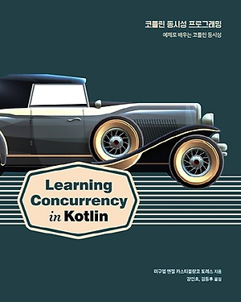

## 코틀린 동시성 스터디

### 진행방식

매주 목요일 1시 주토론자를 중심으로 함께 주제에 대해 논의하며 내용을 정리한다.

- 주토론자 순서

|순번|이름|챕터|날짜|문서|
|---|---|---|---|---|
|1|강현식|1,2|22.02.10|[링크](20220210.md)|
|2|김문근|3,4|22.02.17|[링크](20220217.md)|
|3|김성윤|5,6|22.02.24|[링크](20220224.md)|
|4|서종현|7|22.03.03|[링크](20220303.md)|
|5|홍휘진|8,9|22.03.10|[링크](20220310/README.md)
|6|김세윤|-|22.03.17|
|7|맹기완|-|22.03.24|

#### Contributors

